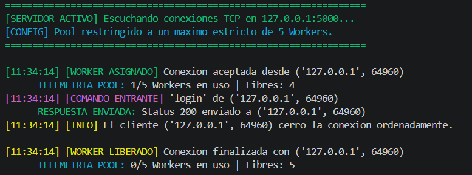
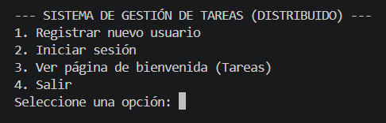
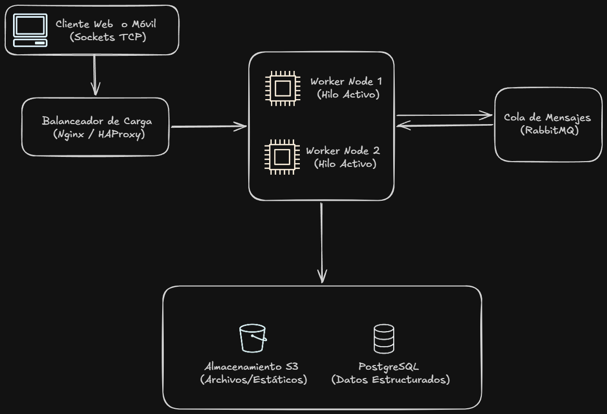

# Tecnicatura Superior en Desarrollo de Software - IFTS Nº 29

## Programación sobre redes

- 2026 | 1º Cuatrimestre | Comisión A
- Profesor: German Rios
- Alumno: Clemens Fernando Oscar

## PFO - 3

# Sistema distribuido

Rediseño de un sistema de gestión de tareas (PFO2) como un sistema distribuido (Cliente-Servidor)

## Ejecución

1. Clonamos el repositorio:

   ```bash
   git clone https://github.com/Ferclemens/PR_3A1C26_PFO3_Clemens_Fernando.git
   cd PR_3A1C26_PFO3_Clemens_Fernando
   ```

2. Creamos el entorno virtual ".venv" y lo inicializamos

   ```bash
   python -m venv .venv
   ```

   luego inicializamos (Windows) con:

   ```bash
   .\.venv\Scripts\activate
   ```

3. Instalamos dependencias:

   ```bash
   python install requirements.txt
   ```

4. Iniciamos servidor:
   ```bash
    python servidor.py
   ```
Vamos a tener una descripción en consola con información sobre worker asignado/liberado, telemetría (workers en uso y libres) y descripción de la tarea que se estan ejecutando.



5. Iniciamos cliente:
   ```bash
    python cliente.py
   ```
Inicializado el cliente. Se muestra el menú con las opciones (tareas) disponibles.



Diagrama del sistema distribuido



Descripción:

1. Clientes (Móviles / Web): Inician las solicitudes de tareas.

2. Balanceador de Carga (Nginx / HAProxy): Recibe las conexiones entrantes en el puerto expuesto y las distribuye entre los servidores disponibles.

3. Servidores Workers (Con Thread Pool): Reciben la conexión redirigida por el balanceador. En lugar de procesar la tarea pesada ahí mismo (lo que bloquearía el socket), actúan como Producers (Productores) enviando la tarea a la cola de mensajes.

4. Cola de Mensajes (RabbitMQ): Recibe las tareas, las encola y garantiza que no se pierdan. Los Workers consumen de acá de forma asincrónica.

5. Almacenamiento Distribuido (PostgreSQL / S3): Una vez procesada la tarea, los datos estructurados (usuarios, estados de tareas) se guardan en PostgreSQL, y los archivos pesados o estáticos (si los hubiera) van a S3.